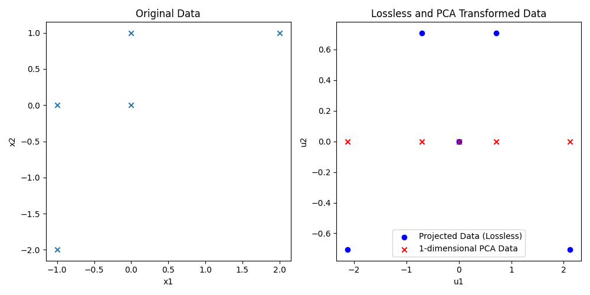

# STATS 303 Homework 2 Answer

1. The centering matrix in principle component analysis is denoted as $H$,
can you find the complete form for matrix $B$ where $B=\sum_{i=1}^n H^i$

    **Answer**:
    $$
    H^2=H\Rightarrow H^i=H\ \forall i\in N^+\\
    \Rightarrow B=\sum_{i=1}^n H^i=\sum_{i=1}^n H=nH\\
    H:=\mathbb I_N-\frac{1}{N}\vec1_N{\vec1_N}^T\\
    \Rightarrow B=n\mathbb I_N-\frac{n}{N}\vec1_N{\vec1_N}^T=
    \begin{bmatrix}
        n-\frac{n}{N} & -\frac{n}{N} & \cdots & -\frac{n}{N}\\
        -\frac{n}{N} & n-\frac{n}{N} & \cdots & -\frac{n}{N}\\
        \vdots & \vdots & \ddots & \vdots\\
        -\frac{n}{N} & -\frac{n}{N} & \cdots & n-\frac{n}{N}
    \end{bmatrix}.
    $$

    Assuming that $n$ and $N$ are just different notations for the same value,
    then

    $$
    B=n\mathbb I_n-\vec1_n{\vec1_n}^T=
    \begin{bmatrix}
        n-1 & -1 & \cdots & -1\\
        -1 & n-1 & \cdots & -1\\
        \vdots & \vdots & \ddots & \vdots\\
        -1 & -1 & \cdots & n-1
    \end{bmatrix}.
    $$

1. Given 5 points: $(-1,0),(0,0),(2,1),(0,1),(-1,-2)$.

    - Please numerically compute the result after applying principle component
    analysis to reduce these data to 1 dimension.

    **Answer**:

    Given:
    $$
    X=\begin{bmatrix}
        -1 & 0\\
        0 & 0\\
        2 & 1\\
        0 & 1\\
        -1 & -2
    \end{bmatrix},\quad N=5\\
    \Rightarrow\bar X=\frac{1}{N}X^T\vec1_N=
    \frac{1}{5}\begin{bmatrix}
        -1 & 0 & 2 & 0 & -1\\
        0 & 0 & 1 & 1 & -2
    \end{bmatrix}\begin{bmatrix}
        1\\1\\1\\1\\1
    \end{bmatrix}=
    \begin{bmatrix}
        0\\
        0
    \end{bmatrix},\\
    H=\mathbb I_N-\frac{1}{N}\vec1_n{\vec1_n}^T=
    \begin{bmatrix}
        1 & 0 & 0 & 0 & 0\\
        0 & 1 & 0 & 0 & 0\\
        0 & 0 & 1 & 0 & 0\\
        0 & 0 & 0 & 1 & 0\\
        0 & 0 & 0 & 0 & 1
    \end{bmatrix}-\frac{1}{5}\begin{bmatrix}
        1 & 1 & 1 & 1 & 1\\
        1 & 1 & 1 & 1 & 1\\
        1 & 1 & 1 & 1 & 1\\
        1 & 1 & 1 & 1 & 1\\
        1 & 1 & 1 & 1 & 1
    \end{bmatrix}\\=
    \begin{bmatrix}
        \frac{4}{5} & -\frac{1}{5} & -\frac{1}{5} & -\frac{1}{5} & -\frac{1}{5}\\
        -\frac{1}{5} & \frac{4}{5} & -\frac{1}{5} & -\frac{1}{5} & -\frac{1}{5}\\
        -\frac{1}{5} & -\frac{1}{5} & \frac{4}{5} & -\frac{1}{5} & -\frac{1}{5}\\
        -\frac{1}{5} & -\frac{1}{5} & -\frac{1}{5} & \frac{4}{5} & -\frac{1}{5}\\
        -\frac{1}{5} & -\frac{1}{5} & -\frac{1}{5} & -\frac{1}{5} & \frac{4}{5}
    \end{bmatrix},\\
    S=\frac{1}{N}X^THX\\=
    \frac{1}{5}\begin{bmatrix}
        -1 & 0 & 2 & 0 & -1\\
        0 & 0 & 1 & 1 & -2
    \end{bmatrix}\begin{bmatrix}
        \frac{4}{5} & -\frac{1}{5} & -\frac{1}{5} & -\frac{1}{5} & -\frac{1}{5}\\
        -\frac{1}{5} & \frac{4}{5} & -\frac{1}{5} & -\frac{1}{5} & -\frac{1}{5}\\
        -\frac{1}{5} & -\frac{1}{5} & \frac{4}{5} & -\frac{1}{5} & -\frac{1}{5}\\
        -\frac{1}{5} & -\frac{1}{5} & -\frac{1}{5} & \frac{4}{5} & -\frac{1}{5}\\
        -\frac{1}{5} & -\frac{1}{5} & -\frac{1}{5} & -\frac{1}{5} & \frac{4}{5}
    \end{bmatrix}\begin{bmatrix}
        -1 & 0\\
        0 & 0\\
        2 & 1\\
        0 & 1\\
        -1 & -2
    \end{bmatrix}\\=
    \frac{1}{5}\begin{bmatrix}
        -1 & 0 & 2 & 0 & -1\\
        0 & 0 & 1 & 1 & -2
    \end{bmatrix}\begin{bmatrix}
        -1 & 0\\
        0 & 0\\
        2 & 1\\
        0 & 1\\
        -1 & -2
    \end{bmatrix}=
    \frac{1}{5}\begin{bmatrix}
        6 & 4\\
        4 & 6
    \end{bmatrix}\\=
    \begin{bmatrix}
        \frac{6}{5} & \frac{4}{5}\\
        \frac{4}{5} & \frac{6}{5}
    \end{bmatrix}.
    $$

    To maximize covariance, let:

    $$
    S\vec{u}:= \lambda\vec{u}\\
    \Rightarrow (S - \lambda \mathbb I)\vec{u} = \vec0\\
    \Rightarrow \det(S - \lambda \mathbb I) = 0\\
    \Rightarrow \det\left(\begin{bmatrix}
        \frac{6}{5} - \lambda & \frac{4}{5} \\
        \frac{4}{5} & \frac{6}{5} - \lambda
    \end{bmatrix}\right
    ) = 0\\
    \Rightarrow \left(\frac{6}{5} - \lambda\right)^2 -
    \left(\frac{4}{5}\right)^2 = 0 \\
    \Rightarrow \lambda = \frac{6}{5} \pm \frac{4}{5}\\
    \Rightarrow \lambda_1 = 2,\ \lambda_2= \frac{2}{5}.
    $$

    For PCA to $q=1$ dimension,
    we choose the eigenvector corresponding to the largest eigenvalue
    $\lambda_1$:

    $$
    (S-\lambda_1\mathbb I)\vec{u}_1:=\vec0\\
    \Rightarrow \begin{bmatrix}
        \frac{6}{5} - 2 & \frac{4}{5} \\
        \frac{4}{5} & \frac{6}{5} - 2
    \end{bmatrix}\begin{bmatrix}
        u_{11}\\
        u_{12}
    \end{bmatrix}=\begin{bmatrix}
        0\\0
    \end{bmatrix}\\
    \Rightarrow \begin{bmatrix}
        -\frac{4}{5} & \frac{4}{5} \\
        \frac{4}{5} & -\frac{4}{5}
    \end{bmatrix}\begin{bmatrix}
        u_{11}\\
        u_{12}
    \end{bmatrix}=\begin{bmatrix}
        0\\0
    \end{bmatrix}\\
    \Rightarrow \begin{bmatrix}
        -1 & 1 \\
        1 & -1
    \end{bmatrix}\begin{bmatrix}
        u_{11}\\
        u_{12}
    \end{bmatrix}=\begin{bmatrix}
        0\\0
    \end{bmatrix}\\
    \Rightarrow u_{11}=u_{12}.
    $$

    Let $u_{11}=1$, then $u_{12}=1$.

    Project the data to the eigenvector:

    $$
    \hat X_i=\sum_{k=1}^q(\tilde X_i^T\vec u_k)\vec u_k=
    ((X_i-\bar X)^T\vec u_1)\vec u_1=
    (X_i^T\vec u_1)\vec u_1\\
    \Rightarrow \hat X=\begin{bmatrix}
        -1 & 0\\
        0 & 0\\
        2 & 1\\
        0 & 1\\
        -1 & -2
    \end{bmatrix}\begin{bmatrix}
        1\\1
    \end{bmatrix}\vec u_1=
    \begin{bmatrix}
        -1\\
        0\\
        3\\
        1\\
        -3
    \end{bmatrix}\vec u_1.
    $$

    That is, the data transformed to 1 dimension are $-1,0,3,1,-3$.

    - Can you code the whole process and visualize the result?

        ```python
        import matplotlib.pyplot as plt
        import numpy as np
        from numpy.linalg import eig, norm

        X = np.array([[-1, 0], [0, 0], [2, 1], [0, 1], [-1, -2]])
        X_mean = np.mean(X, axis=0)
        X_tilde = X - X_mean
        cov_X = np.cov(X_tilde.T)
        S = cov_X / norm(cov_X)

        lambdas, u_vecs = eig(S)
        sorted_indices = np.argsort(lambdas)[::-1]
        u_vecs = u_vecs[:, sorted_indices]
        u_1 = u_vecs[:, 0]

        X_projected = X_tilde @ u_vecs
        X_hat = X_projected[:, 0]
        print(f"Transformed data to 1 dimension:\n{X_hat}")

        fig, axes = plt.subplots(1, 2, figsize=(10, 5))

        # X.
        axes[0].scatter(X[:, 0], X[:, 1], marker="x")
        axes[0].set_title("Original Data")
        axes[0].set_xlabel("x1")
        axes[0].set_ylabel("x2")

        # Transformed.
        axes[1].scatter(
            X_projected[:, 0],
            X_projected[:, 1],
            color="blue",
            marker="o",
            label="Projected Data (Lossless)",
        )
        axes[1].scatter(
            X_hat,
            np.zeros_like(X_hat),
            color="red",
            marker="x",
            label="1-dimensional PCA Data",
        )
        axes[1].set_title("Lossless and PCA Transformed Data")
        axes[1].set_xlabel("u1")
        axes[1].set_ylabel("u2")
        axes[1].legend()

        plt.tight_layout()
        plt.show()
        ```

        Output:

        ```
        Transformed data to 1 dimension:
        [-0.70710678  0.          2.12132034  0.70710678 -2.12132034]
        ```

        

1. Defining the kernel function as $k\left(x_i,
x_j\right)$ which indicates the inner product for $x_i$ and $x_j$ after the
mapping.

    - Please write down the general form of lagrange multiplier objective
    function for kernel hard-margin SVM.
    - Assuming that we are going to apply SMO algorithm to solve it,
    by fixing $\lambda_3, . . \lambda_N$,
    please write down the detailed process and show the final form of the
    objective function in terms of $\lambda_1$

1. If we treat Gibbs sampling as a special case of MH method,
what's the formula for the acceptance rate?
Please simplify the function of acceptance rate.
1. Please implement the MH algorithm to select 10000 samples from an exponential
distribution:

    $$
    \pi(x)=e^{-x}(x \geq 0) .
    $$

    The initial $x=3$ and please plot the histogram of values of $x$ visited by
    MH algorithm.
